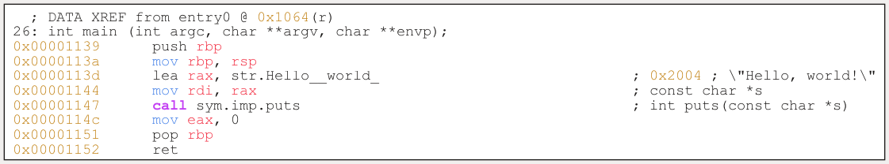
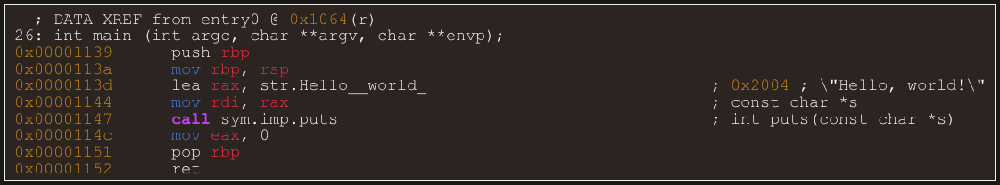
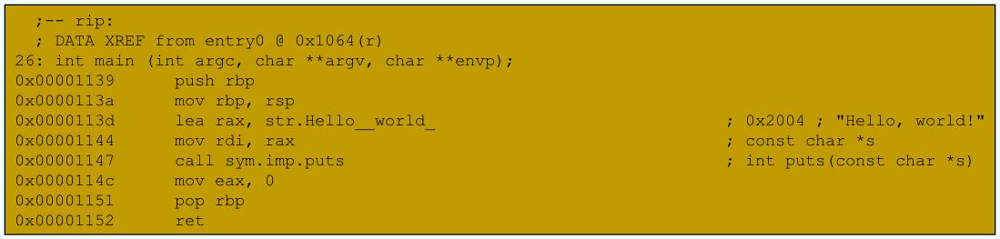

When creating dot files of assembly using the r2 command `agfd`, I don't like how the code looks and that there is no syntax highlighting.

This repository aims to change the appearance and syntax highlighted dot files that are generated by `agfd`.

```
usage: highlight.py [-h] [-o OUTPUT] [--arm] [--dark] input_file

Syntax highlight assembly code in dot files

positional arguments:
  input_file            The input file to be processed

options:
  -h, --help            show this help message and exit
  -o OUTPUT, --output OUTPUT
                        Specify the output file path (default: output.dot)
  --arm                 ARM Syntax Highlighting
  --dark                Dark Color-Palette
```

Afterwards a nice looking pdf can be generated using `dot -Tpdf -o output.pdf output.dot`

. | .
:-------------------------:|:-------------------------:
light | 
dark | 
agfd | 
