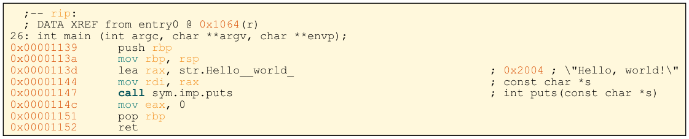

When creating dot files of assembly using the r2 command `agfd`, I don't like how the code looks and that there is no syntax highlighting.

This repository aims to change the appearance and syntax highlighted dot files that are generated by `agfd`.

Usage: `python highlight.py input.dot output.dot`

Afterwards a nice looking pdf can be generated using `dot -Tpdf -o output.pdf output.dot`

Before           |  After
:-------------------------:|:-------------------------:
  |  